
<h1 align="center">基于web的网盘管理系统+vue</h1>

## 简介
网盘管理系统：角色分为管理员、用户；支持文件分享管理、个人信息管理、文件分类查询、文件上传与下载功能；界面简洁，操作便捷，适合毕业设计演示。    --计算机毕业设计源码；毕设源码；java毕业设计源码

## 联系方式

<h3 align="center">获取完整代码与数据库文件 + 微信：deepguan QQ: 86050149 QQ群: 783742310</h3>

<h3 align="center">可帮忙远程部署 包运行成功！提供远程部署、修改代码、设计文档指导、代码讲解等服务！</h3>

## 功能介绍（完整见运行截图）
管理员：基本功能包括登录、注册和退出，能够管理用户、查看和调整系统资源。可以在文件管理模块中筛选、查看和删除用户上传的文件，详细了解文件名称、类型、上传时间等信息。共享文件管理允许按分享用户、文件类型等条件查询并删除文件。支持对用户信息进行管理和更新，界面简洁明了，操作方便。

用户：基本功能包括登录、注册和退出，登录后可访问个人中心修改个人信息如用户名、邮箱和联系方式等。通过文件管理模块进行文件的上传、删除和查询操作，支持按文件名与类型筛选，保护用户隐私，只允许查看和管理自己上传的文件。提供文件分享功能，能够通过分享用户和文件特征进行详细管理和操作，为用户高效管理文件提供便利环境。

## 运行截图
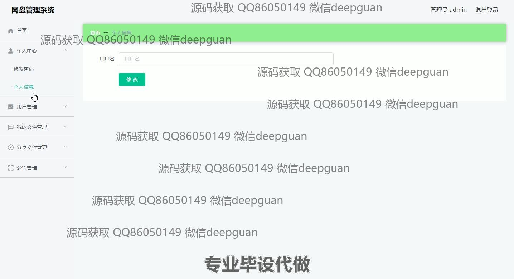
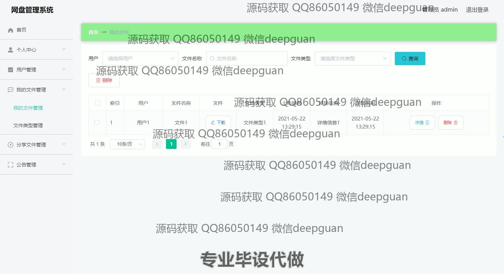
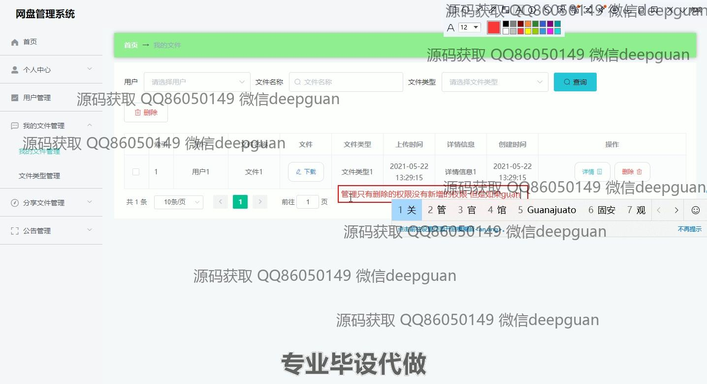
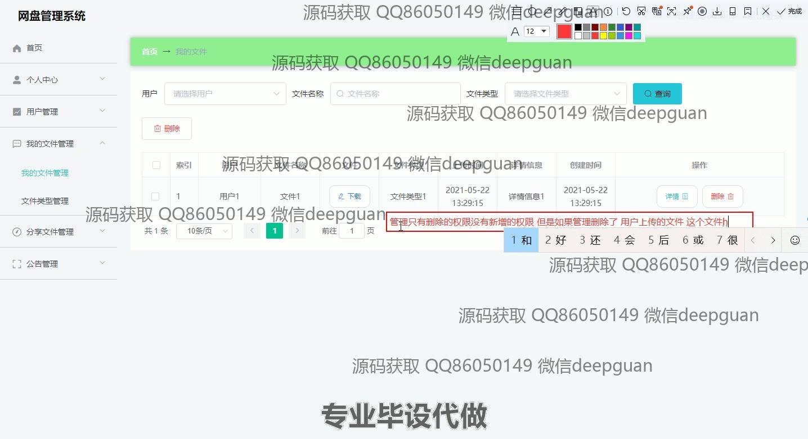
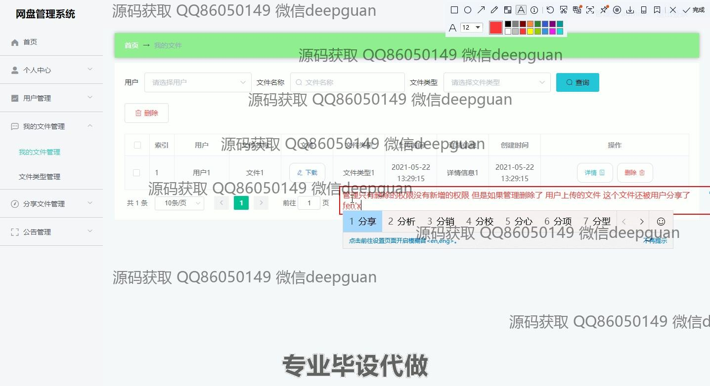
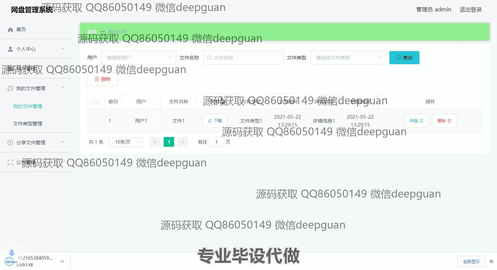
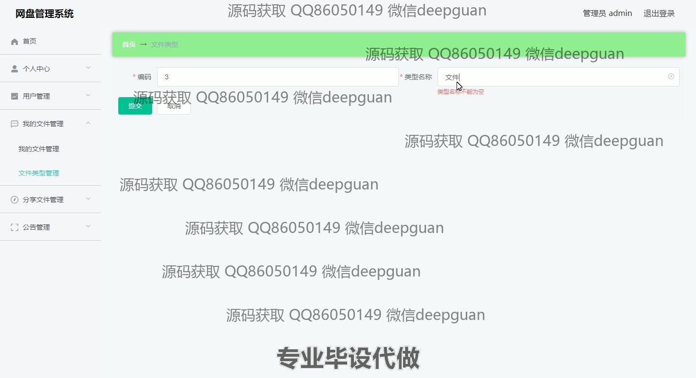
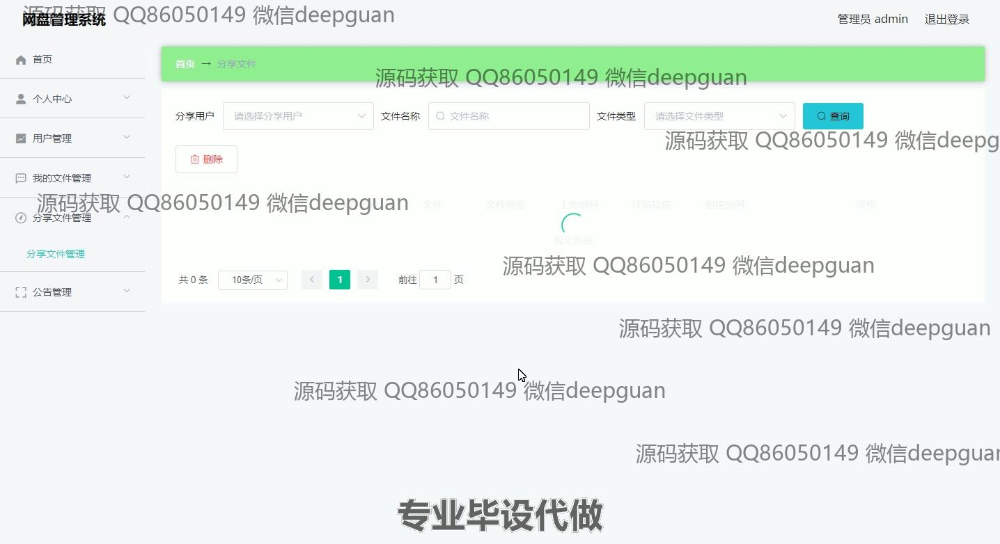

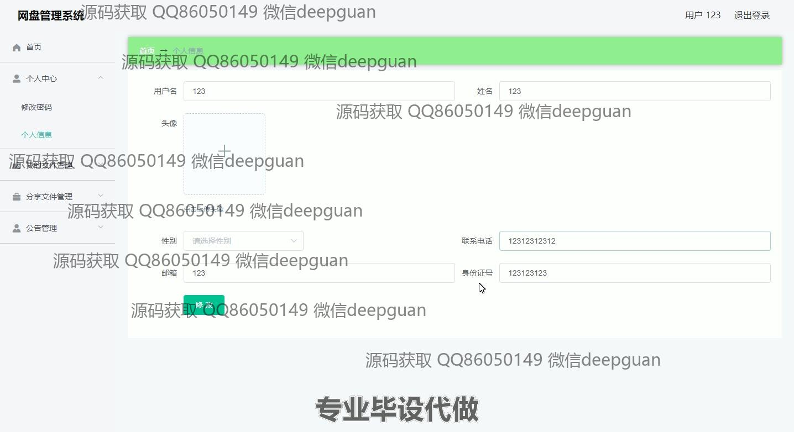
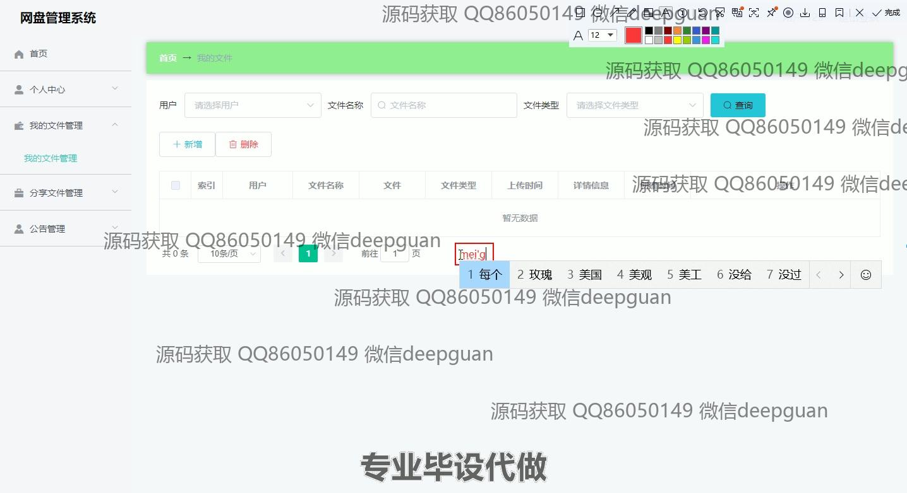
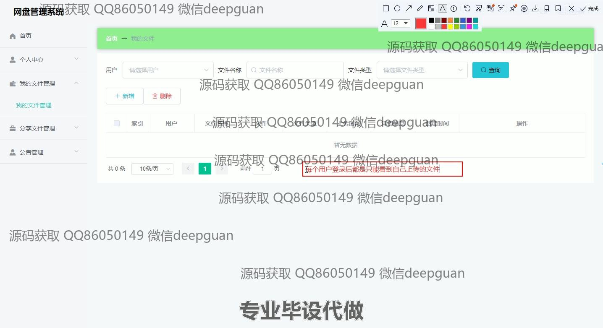

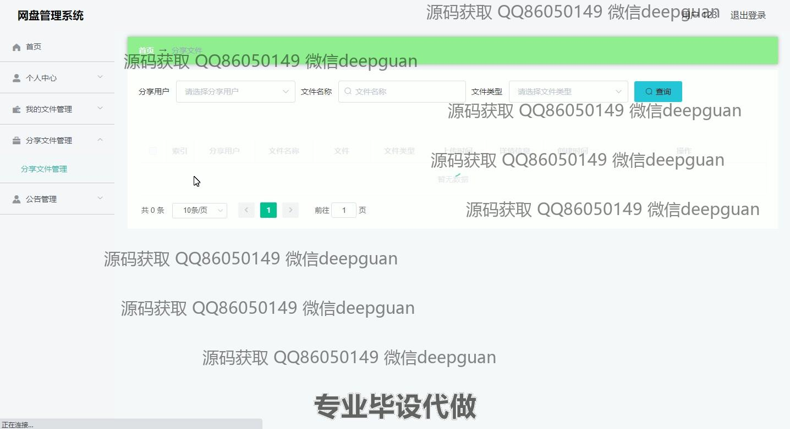
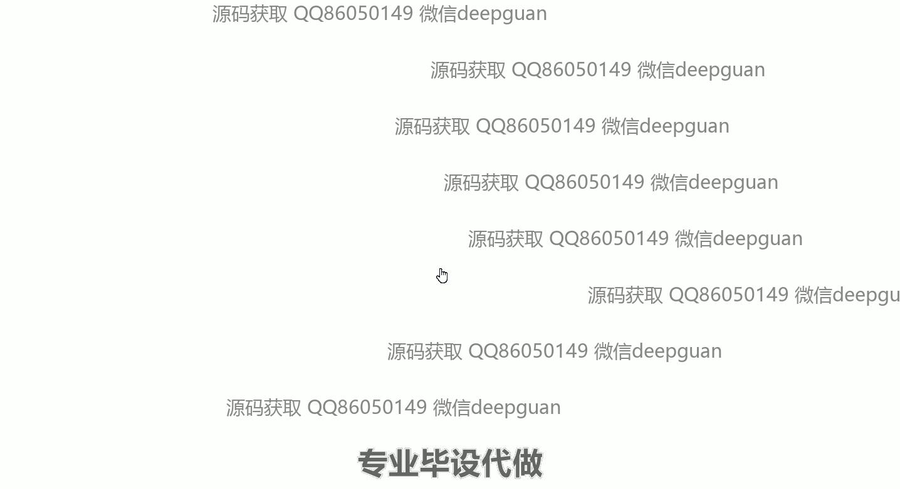
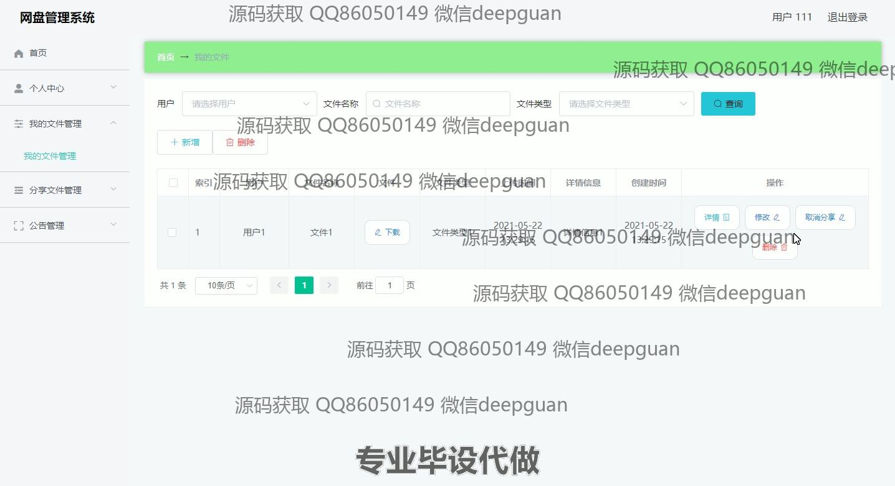
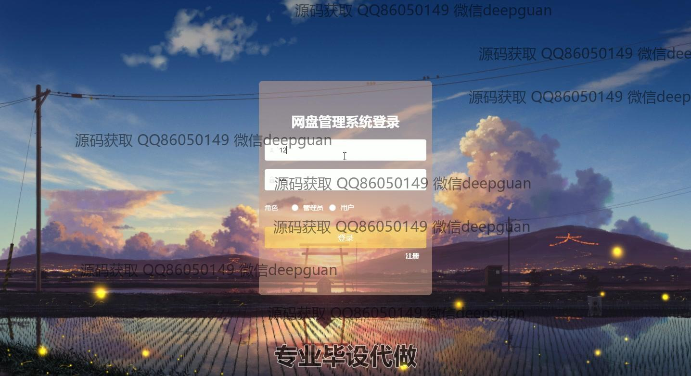
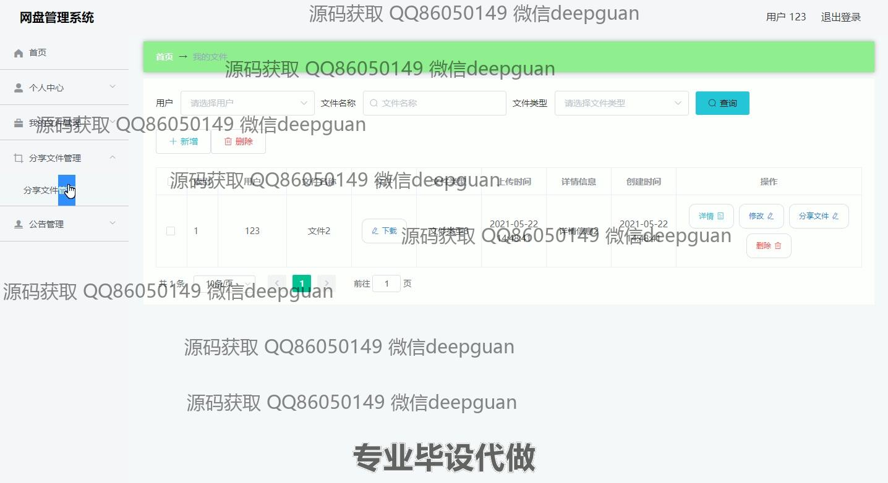

本代码来源于网络,仅供学习参考使用!

